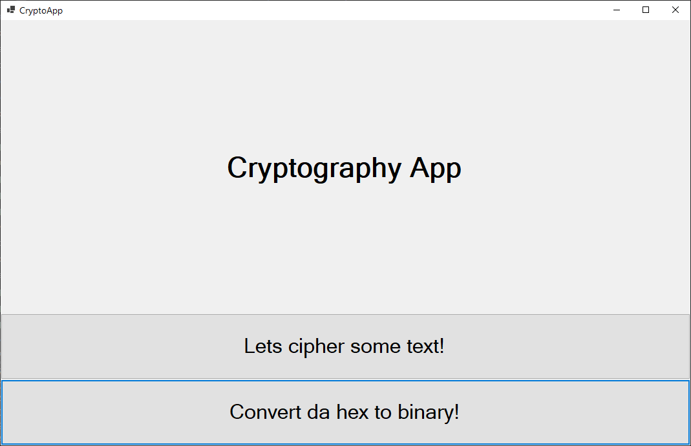
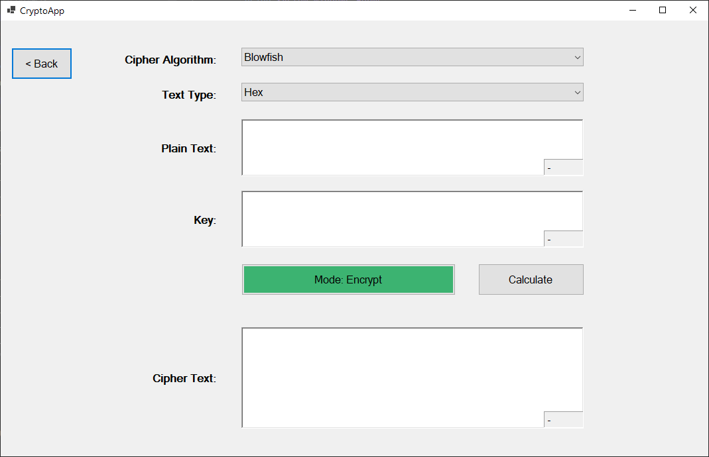
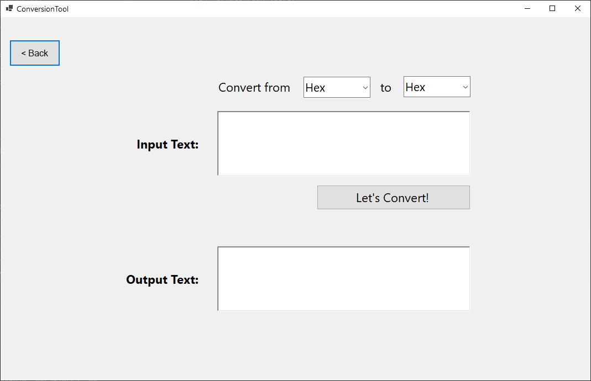

# Cryptography App

As students of Cyber Security course, we researched on cryptographic algorithms and its applications

## Ciphers Available
*  International Data Encryption Algorithm (IDEA) 
*  Blowfish
*  Twofish
*  RC5

## Features

### GUI for interacting with the ciphers
Encrypt and Decrypt using different algorithm with an effective user interface. 

### Number system conversion tool
Convert in any combination between HEX, ASCII, Decimal and Binary numbers.

